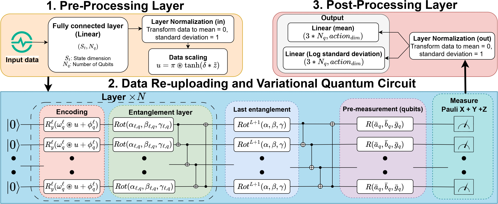
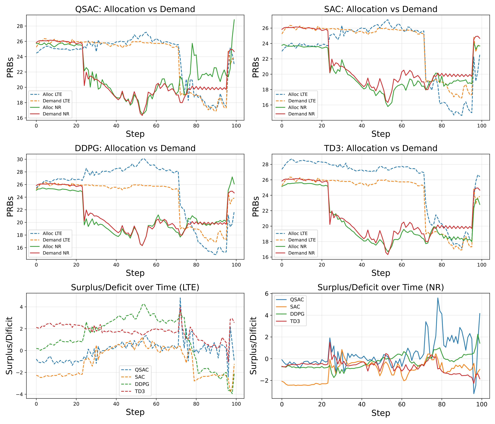

# Quantum-based-Reinforcement-Learning-for-Intelligent-Spectrum-Sharing-in-ORAN
This repository is the official implementation for the paper: "Efficient Quantum Soft Actor-Critic Model for Dynamic Spectrum Sharing in Intelligent O-RAN".
We introduce Quantum Soft Actor-Critic (QSAC), a novel hybrid quantum-classical reinforcement learning model designed to address the Dynamic Spectrum Sharing (DSS) challenge within the Open Radio Access Network (O-RAN) architecture. The model's objective is to intelligently and efficiently allocate spectrum resources between LTE and NR networks, optimizing performance and satisfying user demand in a dynamic environment. We extend and improve from Adapshare's work [1].

# QSAC Actor Architecture


# Key Features
* Hybrid Quantum-Classical RL Model: This is the first study to introduce a Quantum Reinforcement Learning (QRL) model specifically tailored for DSS in O-RAN, leveraging a Variational Quantum Circuit (VQC) for the policy actor.
* Superior Performance: QSAC significantly outperforms classical DRL benchmarks, including SAC, TD3, and DDPG. It achieves a high Demand Satisfaction Ratio (DSR) of 0.989 for NR and 0.987 for LTE.
* Exceptional Compliance: Under strict constraints, QSAC achieves a 91% LTE-5% e-band compliance rate, a substantial improvement over SAC (53%), DDPG (29%), and TD3 (12%).
* Lightweight & Efficient Architecture: The quantum-enhanced actor reduces the number of trainable parameters by over 99% compared to its classical SAC equivalent (from approximately 73,000 down to just 377), indicating a major improvement in model efficiency.
* Stable & Fast Convergence: The model exhibits faster and more stable learning dynamics with reduced reward variance, demonstrating robust policy learning in highly dynamic environments.

# Performance results

## Project Structure
```text
Quantum-based-Reinforcement-Learning-for-Intelligent-Spectrum-Sharing-in-ORAN/
├── Data/                     # Demand data of LTE and NR network
│   ├── LTE_Demand_32.xlsx
│   ├── NR_Demand_32.xlsx
│   ├── LTE_Demand_hourly.tsv
│   └── NR_Demand_hourly.tsv
├── Model/                    # Trained model weights
│   ├── ddpg_actor_model.pth
│   ├── sac_actor_model.pth
│   ├── sac_qactor_actor_model.pth
│   └── td3_actor_model.pth
├── Result/                   # Training logs and comparison results
│   ├── ddpg_training_log.csv
│   ├── sac_training_log.csv
│   ├── sac_qactor_training_log.csv
│   └── td3_training_log.csv
├── _SAC.py                   # Classical SAC algorithm implementation
├── _QSAC.py                  # SAC with Quantum Actor implementation
├── _TD3.py                   # Classical TD3 algorithm implementation
├── _DDPG.py                  # Classical DDPG algorithm implementation
├── MainEnv.py                # O-RAN simulation environment definition
├── Ultils.py                 # Utility functions (e.g., checkpointing)
├── DrawReward.py             # Script to plot reward comparison from log files
├── inference_model_*.py      # Scripts for running inference and evaluating models
├── README.md                 # This file
└── requirements.txt          # (Recommended) Required Python libraries
```

# Getting Started
1. Clone this repository:
```bash
git clone https://github.com/tnvuhai/Efficient-Quantum-Soft-Actor-Critic-Model-for-Dynamic-Spectrum-Sharing-in-Intelligent-O-RAN.git
```
2. Install the required dependencies
```bash
pip install -r requirements.txt
```

# Usage
To train the QSAC model, run the following command:
```bash
python _QSAC.py
```

Other models, please change to [SAC, DDPG, TD3] that you want to train:
```bash

python _*.py *  [SAC, DDPG, TD3]
```

To draw a reward curves figure. run the following command:
```bash
python DrawReward.py
```

To Draw the allocation-demand and surplus/deficit in one figure:
```bash
python inference_model_all_oneFig.py
```

To Draw the allocation-demand and surplus/deficit in one figure:
```bash
python inference_model_all_separated.py
```

This project is licensed under the MIT License. See the LICENSE file for details. 
If you have any questions or issues, please contact my email: nvhai.it.tn@gmail.com or send some issues that you found.
## References
[1] S. Gopal, D. Griffith, R. A. Rouil and C. Liu, "AdapShare: An RL-Based Dynamic Spectrum Sharing Solution for O-RAN," 2025 IEEE 22nd Consumer Communications & Networking Conference (CCNC), Las Vegas, NV, USA, 2025, pp. 1-7, doi: 10.1109/CCNC54725.2025.10976195.


